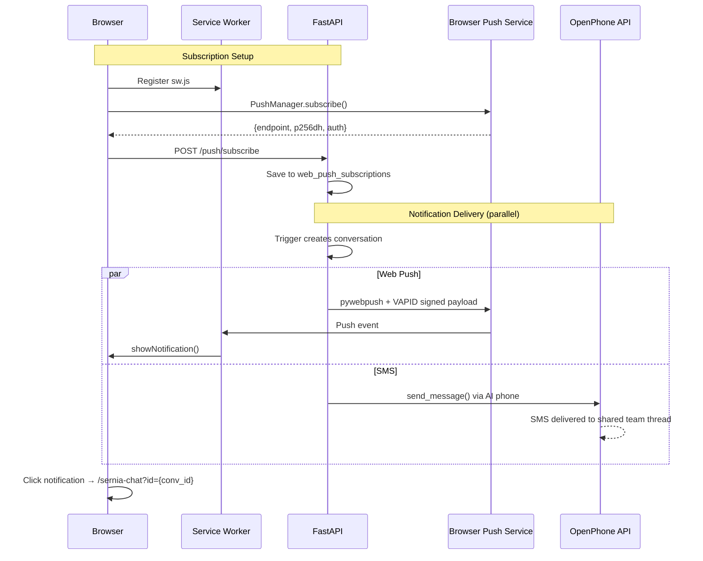
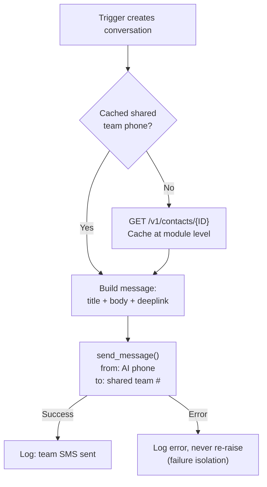

# Notifications (Push + SMS)

Team notifications for Sernia AI's HITL approvals and trigger alerts. Two channels fire in parallel for belt-and-suspenders delivery:

1. **Web Push** — PWA push notifications to phones and desktops (no native app required)
2. **SMS to shared team number** — persistent record in the team's OpenPhone thread with a deeplink to web chat

## Protocol

Uses the **W3C Push API** + **VAPID** (Voluntary Application Server Identification) authentication. This is completely separate from the Expo push module at `api/src/push/` which uses Expo's proprietary push service.

- **Spec**: [W3C Push API](https://www.w3.org/TR/push-api/), [RFC 8292 (VAPID)](https://datatracker.ietf.org/doc/html/rfc8292)
- **Python library**: [pywebpush](https://github.com/web-push-libs/pywebpush) — handles encryption (RFC 8291) and VAPID signing
- **Browser API**: `PushManager.subscribe()` → returns endpoint + encryption keys

### No external services required

Web Push is an open W3C standard built into browsers. **No Firebase, Google Cloud, Apple Developer account, or any third-party dashboard is needed.** Each browser vendor operates its own push service transparently:

- Chrome → Google's FCM (automatic, no setup)
- Safari → Apple's APNs (automatic, no setup)
- Firefox → Mozilla's autopush (automatic, no setup)

When a browser subscribes, it returns an endpoint URL on its vendor's push service. The backend just POSTs encrypted payloads to those URLs, signed with VAPID keys. The only infrastructure is your own Postgres (for storing subscriptions) and the `pywebpush` library.

## Architecture



## SMS Team Notifications

Alongside push, the system sends an SMS from the AI's phone line to the shared team number. This ensures team members without push enabled still get notified, and creates a persistent record in the shared OpenPhone thread.

### How it works



1. **Phone lookup**: `_get_shared_team_phone()` calls `GET /v1/contacts/{QUO_SHARED_TEAM_CONTACT_ID}` once, caches the phone number at module level
2. **Message**: `{title}\n{body}\n\n{deeplink_url}` — the deeplink is `{FRONTEND_BASE_URL}/sernia-chat?id={conversation_id}`
3. **Sending**: Uses `send_message()` from `open_phone/service.py` — from `QUO_SERNIA_AI_PHONE_ID` to the shared team phone
4. **Failure isolation**: Errors logged via `logfire.exception()`, never re-raised. SMS failure never blocks trigger flow.

### Environment awareness

- **Production**: deeplink → `https://eesposito.com/sernia-chat?id=...`
- **Development**: deeplink → `https://dev.eesposito.com/sernia-chat?id=...`, title prefixed with `[DEVELOPMENT]`
- **Local**: deeplink → `http://localhost:5173/sernia-chat?id=...`, title prefixed with `[LOCAL]`

### Circular messaging safety

When `notify_team_sms()` sends FROM the AI phone TO the shared team number, OpenPhone fires a `message.received` webhook on the shared team phone. The webhook handler guards against this by looking up the AI phone's actual number via `GET /v1/phone-numbers/{QUO_SERNIA_AI_PHONE_ID}` (cached at module level). If `from_number` matches the AI phone, the message is skipped before reaching the team SMS event trigger. See `open_phone/routes.py`.

### Config (`config.py`)

| Constant | Purpose |
|----------|---------|
| `QUO_SHARED_TEAM_CONTACT_ID` | OpenPhone contact ID for the shared team number |
| `FRONTEND_BASE_URL` | Environment-aware base URL for deeplinks |
| `QUO_SERNIA_AI_PHONE_ID` | Phone ID used as the SMS sender |

## Environment Variables

All three vars go on the **FastAPI service only** (both Railway and local `.env`). The React Router frontend needs **nothing** — it fetches the public key at runtime via `GET /api/sernia-ai/push/vapid-public-key`.

| Variable | Railway Service | Description |
|----------|----------------|-------------|
| `VAPID_PRIVATE_KEY` | FastAPI | PEM-encoded EC private key for signing push requests |
| `VAPID_PUBLIC_KEY` | FastAPI | URL-safe base64 public key (returned to browser via API) |
| `VAPID_CLAIM_EMAIL` | FastAPI | Contact email in `mailto:` format — included in VAPID headers so browser push services can reach you if your server misbehaves. Not verified. (default: `mailto:admin@serniacapital.com`) |

### Generating VAPID Keys

```bash
source .venv/bin/activate && python adhoc/create_push_keys.py
```

Output is in `.env`-ready format — copy directly into local `.env` and Railway FastAPI service env vars.

### Multi-environment notes

- **Use the same keypair** across local/dev/prod. VAPID keys are just a signing identity. Each environment's DB only stores subscriptions collected on that environment, so there's no cross-talk.
- **localhost vs deployed**: Different browser origins = completely separate push subscriptions. Subscribing on localhost won't affect prod.
- **Duplicate notifications**: You'll only get notified by environments where you clicked the bell icon. A conversation on prod doesn't exist on dev, so no duplicates.

## Files

| File | Purpose |
|------|---------|
| `models.py` | `WebPushSubscription` SQLAlchemy model — stores browser push endpoints |
| `service.py` | Subscription CRUD + push sending via `pywebpush` + SMS team notifications |
| `routes.py` | 3 endpoints: `GET /push/vapid-public-key`, `POST /push/subscribe`, `POST /push/unsubscribe` |
| `apps/web-react-router/public/sw.js` | Service worker — handles `push` + `notificationclick` events only (no caching) |
| `apps/web-react-router/public/manifest.json` | PWA manifest — enables "Add to Home Screen" on mobile |
| `apps/web-react-router/app/hooks/use-push-notifications.ts` | React hook for SW registration, permission, subscribe/unsubscribe |

## Endpoints

All under `/api/sernia-ai/push/`, gated by `_sernia_gate` (requires `@serniacapital.com` Clerk user).

| Endpoint | Method | Purpose |
|----------|--------|---------|
| `/push/vapid-public-key` | GET | Returns VAPID public key for `PushManager.subscribe()` |
| `/push/subscribe` | POST | Saves browser push subscription to DB |
| `/push/unsubscribe` | POST | Removes subscription |

## iOS Notes

- Web Push only works on **iOS Safari 16.4+** when installed as a **standalone PWA** (Add to Home Screen)
- The `manifest.json` + `apple-mobile-web-app-capable` meta tag in `root.tsx` enables this
- The React hook detects iOS + non-standalone → shows "Install app for notifications" hint

## Debugging

- **Chrome DevTools** → Application → Service Workers: verify `sw.js` registered
- **Chrome DevTools** → Application → Manifest: verify `manifest.json` detected
- **DB check**: `SELECT * FROM web_push_subscriptions;` to see active subscriptions
- **Push not arriving?**: Check `VAPID_PRIVATE_KEY` is set, check Logfire for `web push send error`
- **410 Gone**: Subscription expired (browser revoked) — auto-cleaned by `notify_all_sernia_users`
