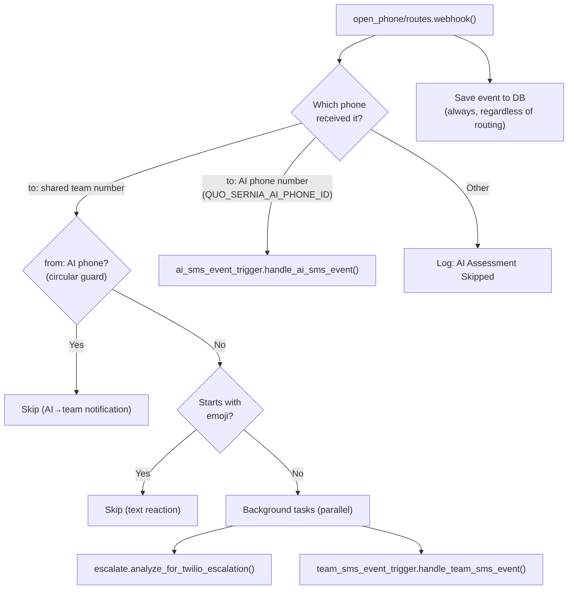
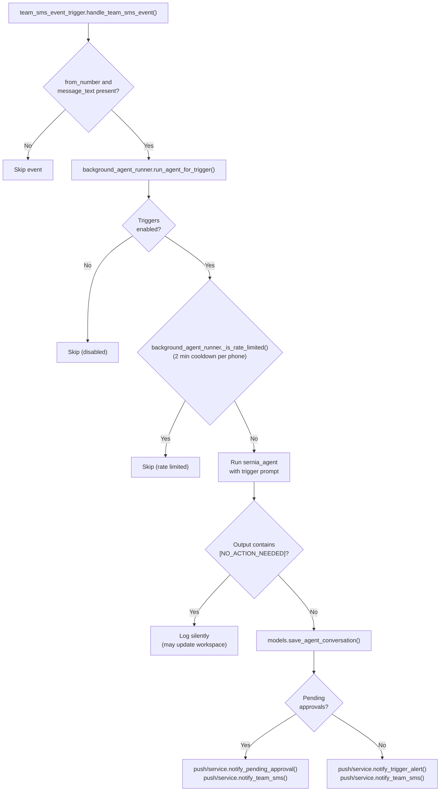
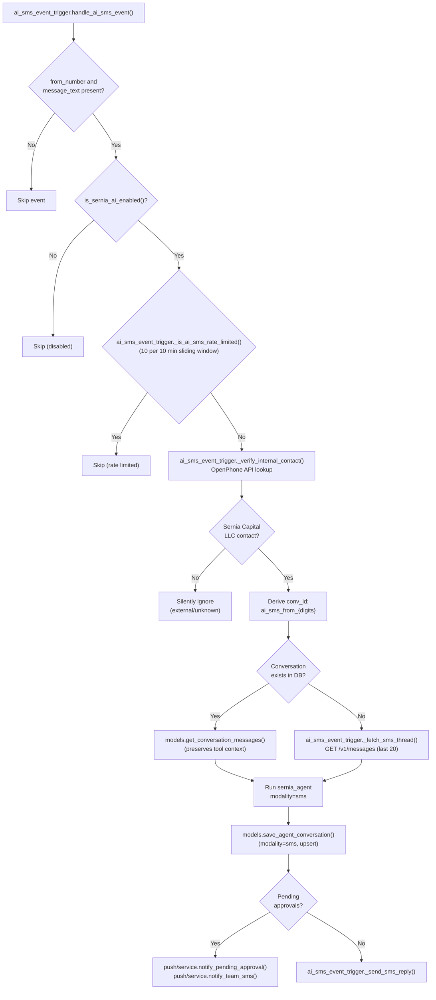
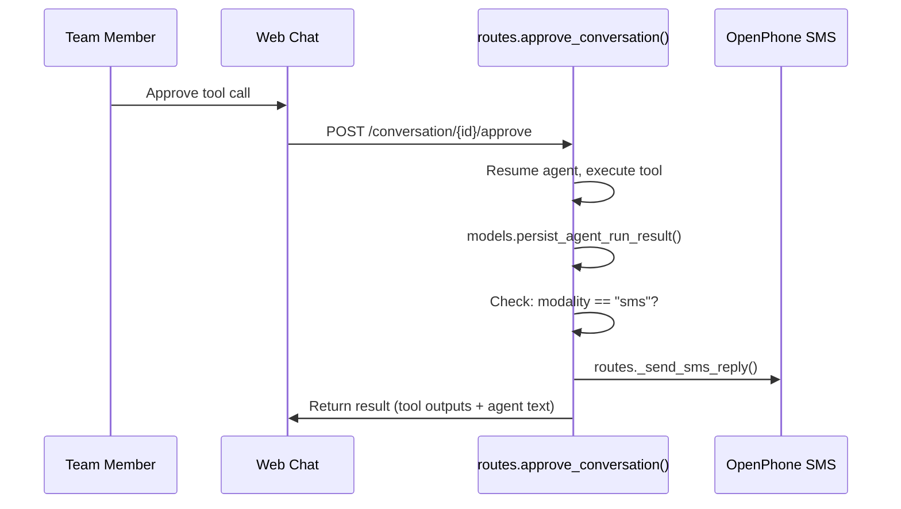

# Triggers

Event-driven background processing for the Sernia AI agent. Triggers run the agent outside of an HTTP request context — no Clerk user, no streaming — and create web chat conversations when human attention is needed.

## Two SMS Modalities

The OpenPhone webhook routes inbound SMS to one of two handlers based on which phone number received the message:

| Modality | Handler | Phone Number | Purpose |
|----------|---------|-------------|---------|
| **Team SMS event trigger** | `team_sms_event_trigger.py` | Shared team number (`sernia` contact) | Monitor, analyze, alert team via web chat |
| **AI SMS event trigger** | `ai_sms_event_trigger.py` | AI's direct line (`QUO_SERNIA_AI_PHONE_ID`) | Direct conversation — AI responds natively via SMS |

### Webhook Routing

## Team SMS Event Trigger Flow

The team SMS event trigger monitors incoming messages and decides whether the team needs to be alerted. The agent runs with full tool access and either handles the event silently or creates a web chat conversation.

## AI SMS Event Trigger Flow

The AI SMS event trigger treats the SMS thread as a direct conversation. Only internal contacts (Sernia Capital LLC) are allowed. The agent responds natively via SMS.

### Post-Approval SMS Reply

When a team member approves an action in web chat for an AI SMS conversation, the approval endpoint detects `modality="sms"` and sends the agent's result back via SMS:

## Email Scheduled Trigger Flow

Two scheduled jobs via APScheduler poll the Gmail inbox:

| Job | Interval | Scope |
|-----|----------|-------|
| `email_scheduled_trigger.check_general_emails()` | 3 hours | Unread inbox (excludes Zillow, promotions) |
| `email_scheduled_trigger.check_zillow_emails()` | 3 hours (8am-5pm ET) | Zillow leads with qualification criteria |

Both use `background_agent_runner.run_agent_for_trigger()` with the same silent/alert pattern as the team SMS event trigger.

## Universal Kill Switch (`is_sernia_ai_enabled`)

The `triggers_enabled` app setting in the DB acts as a universal kill switch for all **automated** agent runs. It prevents triggers from firing in lower environments (dev, PR envs) where webhooks or schedulers might still deliver events.

| Path | Gated? | Why |
|------|--------|-----|
| Team SMS event trigger | Yes | Automated — webhook-driven |
| AI SMS event trigger | Yes | Automated — webhook-driven |
| General email trigger | Yes | Automated — scheduler-driven |
| Zillow email trigger | Yes | Automated — scheduler-driven |
| Web chat (`/chat`) | **No** | User-initiated, intentional |
| HITL approvals (`/approve`) | **No** | User-initiated, write actions already behind HITL |

**Default**: Enabled on production, disabled elsewhere (safety net for dev/PR envs). DB setting overrides the environment-based default when present.

**Implementation**: `is_sernia_ai_enabled()` in `sernia_ai/models.py` — shared by `background_agent_runner.py` and `ai_sms_event_trigger.py`.

## Rate Limiting

### Team SMS / Email triggers

Shared in-memory rate limiter in `background_agent_runner.py`:

- **Cooldown**: 2 minutes per key
- **Key format**: `{trigger_source}:{rate_limit_key}` (e.g., `sms:+14155550100`)
- **Scope**: Per-process, resets on restart
- **Behavior**: First call within window proceeds, subsequent calls are logged and skipped

### AI SMS event trigger

Separate sliding-window rate limiter in `ai_sms_event_trigger.py`:

- **Window**: 10 minutes
- **Max calls**: 10 per phone number per window
- **Scope**: Per-process, resets on restart
- **Behavior**: Allows burst traffic up to the limit, then blocks until older timestamps fall outside the window

## Files

| File | Purpose |
|------|---------|
| `background_agent_runner.py` | Core async runner: triggers-enabled check, rate limiting, agent run, silent/alert routing, push + SMS notifications |
| `team_sms_event_trigger.py` | Team SMS event trigger: builds prompt from inbound SMS, calls `run_agent_for_trigger()` |
| `ai_sms_event_trigger.py` | AI SMS event trigger: contact gate, history loading/bootstrap, agent run with `modality="sms"`, SMS reply |
| `email_scheduled_trigger.py` | Email scheduled triggers: `check_general_emails()` and `check_zillow_emails()` with Gmail search prompts |
| `register_scheduled_triggers.py` | Registers APScheduler jobs for email scheduled triggers |

## Config (`config.py`)

| Constant | Purpose |
|----------|---------|
| `TRIGGER_BOT_ID` | `"system:sernia-ai"` — clerk_user_id for agent-initiated conversations |
| `TRIGGER_BOT_NAME` | `"Sernia AI (Trigger)"` — display name |
| `QUO_SERNIA_AI_PHONE_ID` | AI's phone line (used for SMS replies and team notifications) |
| `QUO_INTERNAL_COMPANY` | `"Sernia Capital LLC"` — gate for AI SMS contact verification |
| `SMS_CONVERSATION_MAX_MESSAGES` | Max messages to fetch from OpenPhone for SMS conversation bootstrap (20) |
| `GENERAL_EMAIL_CHECK_INTERVAL_MINUTES` | Email check frequency (180 min) |
| `ZILLOW_EMAIL_CHECK_INTERVAL_HOURS` | Zillow email check frequency (3 hours) |
