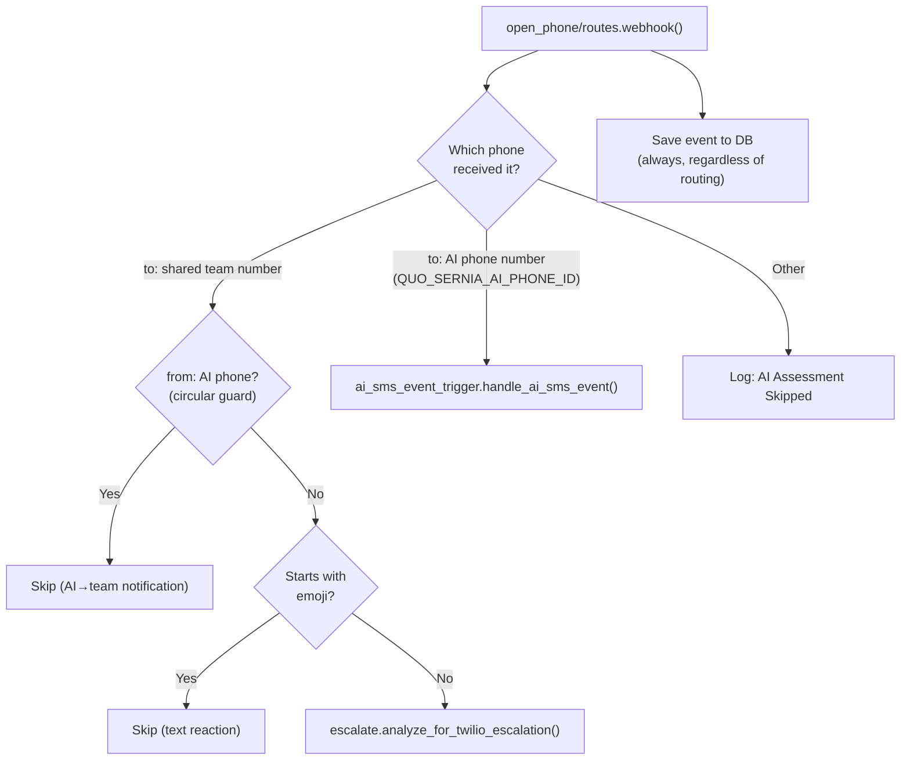
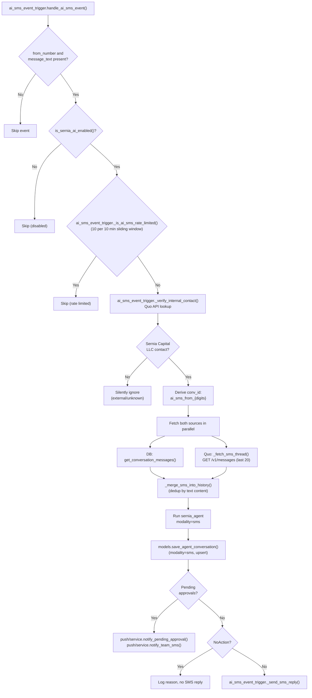
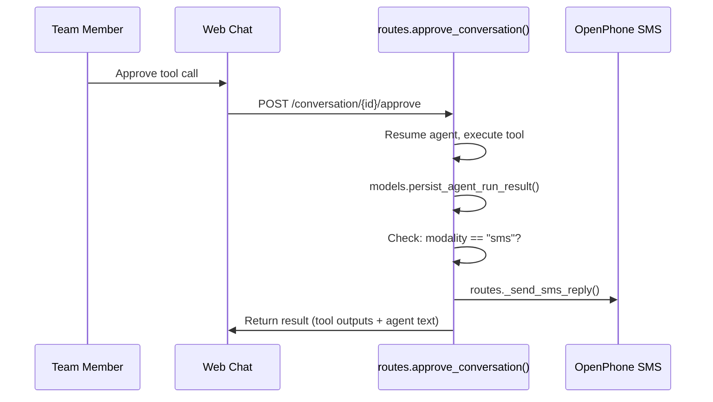
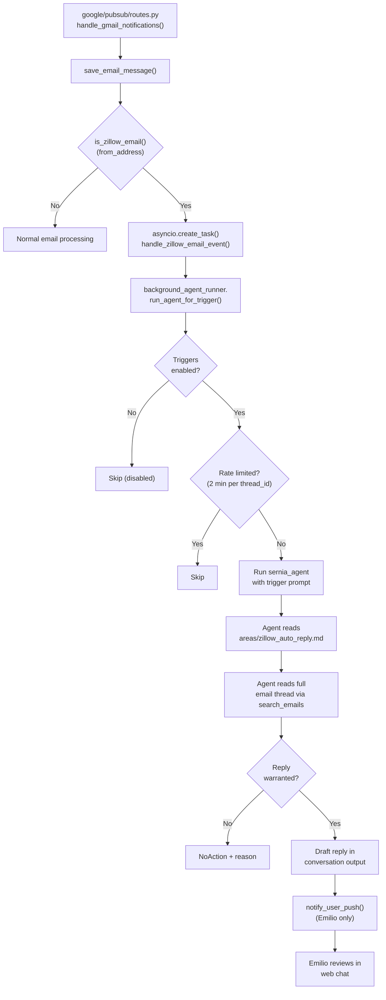

# Triggers

Event-driven background processing for the Sernia AI agent. Triggers run the agent outside of an HTTP request context — no Clerk user, no streaming — and create web chat conversations when human attention is needed.

## SMS Handling

The OpenPhone webhook routes inbound SMS based on which phone number received the message:

| Phone Number | Handler | Purpose |
|-------------|---------|---------|
| AI's direct line (`QUO_SERNIA_AI_PHONE_ID`) | `ai_sms_event_trigger.py` | Direct conversation — AI responds natively via SMS |
| Shared team number | Twilio escalation only | `analyze_for_twilio_escalation()` — no AI agent run |

> **Note:** The team SMS event trigger (`team_sms_event_trigger.py`) was removed — it fired too many agent runs (214 events) for marginal value. Team SMS ClickUp task creation will be folded into the scheduled check at a later date.

### Webhook Routing

## AI SMS Event Trigger Flow

The AI SMS event trigger treats the SMS thread as a direct conversation. Only internal contacts (Sernia Capital LLC) are allowed. The agent responds natively via SMS.

### History Loading

The trigger always fetches from **both** sources and merges them:

1. **DB history** — `get_conversation_messages()` preserves full tool call context from prior agent runs
2. **Quo SMS thread** — `_fetch_sms_thread()` via `GET /v1/messages` captures messages sent from any conversation (e.g. web chat tool calls, context-seeded messages)

`_merge_sms_into_history()` deduplicates by text content — any SMS messages whose text is missing from DB history are prepended. This ensures the agent sees the full picture even when messages were sent outside the AI SMS conversation (e.g. via `send_internal_sms` from web chat). If both sources return empty (e.g. Quo API hasn't indexed recent messages yet), a hint is injected telling the agent to use `get_contact_sms_history`.

### Post-Approval SMS Reply

When a team member approves an action in web chat for an AI SMS conversation, the approval endpoint detects `modality="sms"` and sends the agent's result back via SMS:

## Zillow Email Event Trigger Flow

Real-time Zillow lead processing. When a new email arrives via Gmail Pub/Sub and is from `zillow.com`, the trigger fires immediately (not on a schedule).

**Phase 1 (Training):** Agent drafts a reply but does NOT send it. Emilio receives a targeted push notification to review the draft in web chat. The detailed guide lives in `.workspace/areas/zillow_auto_reply.md` — editable without code deploys.

**Phase 2 (planned):** Agent calls `send_external_email` (already approval-gated via HITL). Emilio approves/denies in web chat.

### Key design choices

- **Trigger instructions stay lean** — point to `areas/zillow_auto_reply.md` for detailed guidance (qualification criteria, availability schedule, response tone). This allows iterating on AI behavior without code deploys.
- **Emilio-only notifications** — looks up Emilio's `clerk_user_id` from DB via contact slug `"emilio"` (cached at module level), then uses `notify_clerk_user_id` parameter in `run_agent_for_trigger()` to send push only to Emilio's subscriptions via `notify_user_push()`.
- **Rate limiting** — keyed by `thread:{thread_id}` so the same thread doesn't fire multiple triggers within 2 minutes.
- **Coexists with scheduled check** — `run_scheduled_checks()` still runs every 3 hours as a safety net, catching anything the event trigger misses (e.g., server downtime).

## Scheduled Trigger Flow

A single scheduled job via APScheduler in `scheduled_triggers.py`:

| Job | Interval | Scope |
|-----|----------|-------|
| `run_scheduled_checks()` | Configurable (default: Mon–Fri at 8am, 11am, 2pm, 5pm ET) | All inbox checks — agent follows the `scheduled-checks` skill |

The schedule is configurable via the Settings page (`/sernia-settings`) or the `schedule_config` key in `app_settings`. The DB-backed config stores `days_of_week` (0=Mon … 6=Sun) and `hours` (ET, 24-hour). Changes take effect immediately — the APScheduler job is re-registered on save.

The trigger is a thin function that points the agent to the `scheduled-checks` workspace skill. All domain logic (what to check, how to assess, output rules) lives in `skills/scheduled-checks/SKILL.md`, not in trigger code.

Uses `background_agent_runner.run_agent_for_trigger()` with the silent/alert pattern. When the agent uses the `NoAction` structured output, the runner persists the conversation but skips push notifications.

## Universal Kill Switch (`is_sernia_ai_enabled`)

The `triggers_enabled` app setting in the DB acts as a universal kill switch for all **automated** agent runs. It prevents triggers from firing in lower environments (dev, PR envs) where webhooks or schedulers might still deliver events.

| Path | Gated? | Why |
|------|--------|-----|
| AI SMS event trigger | Yes | Automated — webhook-driven |
| Zillow email event trigger | Yes | Automated — webhook-driven (Pub/Sub → real-time) |
| Scheduled checks | Yes | Automated — scheduler-driven (email + SMS inbox checks) |
| Web chat (`/chat`) | **No** | User-initiated, intentional |
| HITL approvals (`/approve`) | **No** | User-initiated, write actions already behind HITL |

**Default**: Enabled on production, disabled elsewhere (safety net for dev/PR envs). DB setting overrides the environment-based default when present.

**Implementation**: `is_sernia_ai_enabled()` in `sernia_ai/models.py` — shared by `background_agent_runner.py` and `ai_sms_event_trigger.py`.

## Rate Limiting

### Background agent runner

Shared in-memory rate limiter in `background_agent_runner.py`:

- **Cooldown**: 2 minutes per key
- **Key format**: `{trigger_source}:{rate_limit_key}` (e.g., `ai_sms:+14155550100`)
- **Scope**: Per-process, resets on restart
- **Behavior**: First call within window proceeds, subsequent calls are logged and skipped

### AI SMS event trigger

Separate sliding-window rate limiter in `ai_sms_event_trigger.py`:

- **Window**: 10 minutes
- **Max calls**: 10 per phone number per window
- **Scope**: Per-process, resets on restart
- **Behavior**: Allows burst traffic up to the limit, then blocks until older timestamps fall outside the window

## Files

| File | Purpose |
|------|---------|
| `background_agent_runner.py` | Core async runner: triggers-enabled check, rate limiting, agent run, `NoAction`/alert routing, push notifications (supports `notify_clerk_user_id` for targeted push) |
| `zillow_email_event_trigger.py` | Zillow email event trigger: real-time draft generation when Zillow emails arrive via Pub/Sub, Emilio-only push notification |
| `ai_sms_event_trigger.py` | AI SMS event trigger: contact gate, history loading/bootstrap, agent run with `modality="sms"`, SMS reply |
| `scheduled_triggers.py` | Single scheduled trigger + APScheduler registration: `run_scheduled_checks()` |

## Config (`config.py`)

| Constant | Purpose |
|----------|---------|
| `TRIGGER_BOT_ID` | `"system:sernia-ai"` — clerk_user_id for agent-initiated conversations |
| `TRIGGER_BOT_NAME` | `"Sernia AI (Trigger)"` — display name |
| `QUO_SERNIA_AI_PHONE_ID` | AI's phone line (used for SMS replies and team notifications) |
| `QUO_INTERNAL_COMPANY` | `"Sernia Capital LLC"` — gate for AI SMS contact verification |
| `SMS_CONVERSATION_MAX_MESSAGES` | Max messages to fetch from OpenPhone for SMS conversation bootstrap (20) |
| `DEFAULT_SCHEDULE_DAYS_OF_WEEK` | Default days (Mon–Fri) — overridden by `schedule_config` DB setting |
| `DEFAULT_SCHEDULE_HOURS` | Default hours (`[8,11,14,17]` ET) — overridden by `schedule_config` DB setting |
| `EMILIO_CONTACT_SLUG` | `"emilio"` — contact slug used to look up Emilio's `clerk_user_id` from DB (contacts → users join) |
