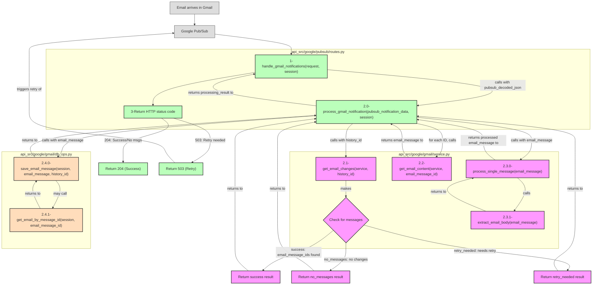

# Gmail Notification System Documentation

This document explains how Gmail notifications are handled in the system using Google Pub/Sub.

## Overview

The system uses Google Pub/Sub to receive Gmail notifications when new emails arrive. The general flow is:

1. Gmail API watch function monitors a mailbox
2. Gmail notifies our Pub/Sub topic when changes occur
3. Pub/Sub delivers a notification to our webhook endpoint
4. Our system processes the notification and fetches the new emails
5. Emails are saved to our database

## Flow Diagram



## Key Functions and Flow

### 1. `handle_gmail_notifications`

This is the entry point - a FastAPI route that receives notifications from Google Pub/Sub.

**Responsibilities:**
- Validate the request is from Google Pub/Sub
- Extract and decode the message data
- Pass the decoded data to the processor
- Return appropriate status code based on processing results

**Status Codes:**
- `204`: Successfully processed or confirmed no messages to process
- `503`: Temporary failure; Pub/Sub should retry

### 2. `process_gmail_notification`

This function processes the notification and fetches any new emails.

**Responsibilities:**
- Get Gmail service with appropriate credentials
- Fetch message IDs using history ID from the notification
- Process each message and save to database
- Return a structured result with processing status

**Return Value Structure:**
```python
{
    "status": "success" | "no_messages" | "retry_needed",
    "messages": [list_of_processed_messages],
    "reason": "Explanation of what happened"
}
```

### 3. `get_email_changes`

This function fetches the list of message IDs that have changed since a specific history ID and makes the primary status decision.

**Responsibilities:**
- Query Gmail API for changes since the given history ID
- Use exponential backoff to handle race conditions 
- Make the primary status determination:
  - `success`: Found history and new message IDs
  - `no_messages`: Found history but no new messages
  - `retry_needed`: Could not retrieve history (needs retry)
- Return both status and message IDs in a structured format

**Return Value Structure:**
```python
{
    "status": "success" | "no_messages" | "retry_needed",
    "email_message_ids": [list_of_message_ids],
    "reason": "Explanation of what happened"
}
```

### 4. `get_email_content` and `process_single_message`

These functions fetch and process individual email messages.

**Responsibilities:**
- Fetch full message content from Gmail API
- Extract relevant information (subject, body, etc.)
- Format into a structure ready for database storage

## Retry Logic and Status Codes

The system is designed to handle temporary failures gracefully:

### When 204 (Success) is Returned
- When all messages are successfully processed
- When we've confirmed there are no messages to process for this notification
- This tells Pub/Sub the message was handled successfully

### When 503 (Service Unavailable) is Returned
- When Gmail history ID isn't available yet (race condition)
- When we found message IDs but couldn't process them
- When unexpected errors occur during processing
- This tells Pub/Sub to retry the notification later

## Pub/Sub Configuration

For reliable processing, the Pub/Sub subscription should have:
- Acknowledgement deadline: At least 120 seconds
- Retry policy: Exponential backoff (currently 10s min, 600s max)

## Common Issues and Debugging

- **Same notification appears multiple times**: This is normal if the Gmail API hasn't made the messages available yet. The 503 status code triggers Pub/Sub to retry.
- **"No new messages found"**: The Gmail API sometimes sends notifications before changes are available. The system will retry until it can access the messages.
- **Messages not appearing in database**: Check the logs for specific message processing errors.

### Status Flow

Status determinations flow through the system as follows:

1. **Primary Status Decision** - Made in `get_email_changes`:
   - Determines if history is available and if there are messages to process
   - This status is passed directly to the caller for "no_messages" and "retry_needed" cases

2. **Status Override** - Only happens in `process_gmail_notification` when needed:
   - Maintains "success" status if all messages are processed successfully
   - Overrides to "retry_needed" if message processing fails
   - Statuses from `get_email_changes` are never overridden for "no_messages" or "retry_needed"

3. **HTTP Response Status** - Determined in `handle_gmail_notifications`:
   - 204: For "success" and "no_messages" results (acknowledged)
   - 503: For "retry_needed" results (temporary failure, retry) 