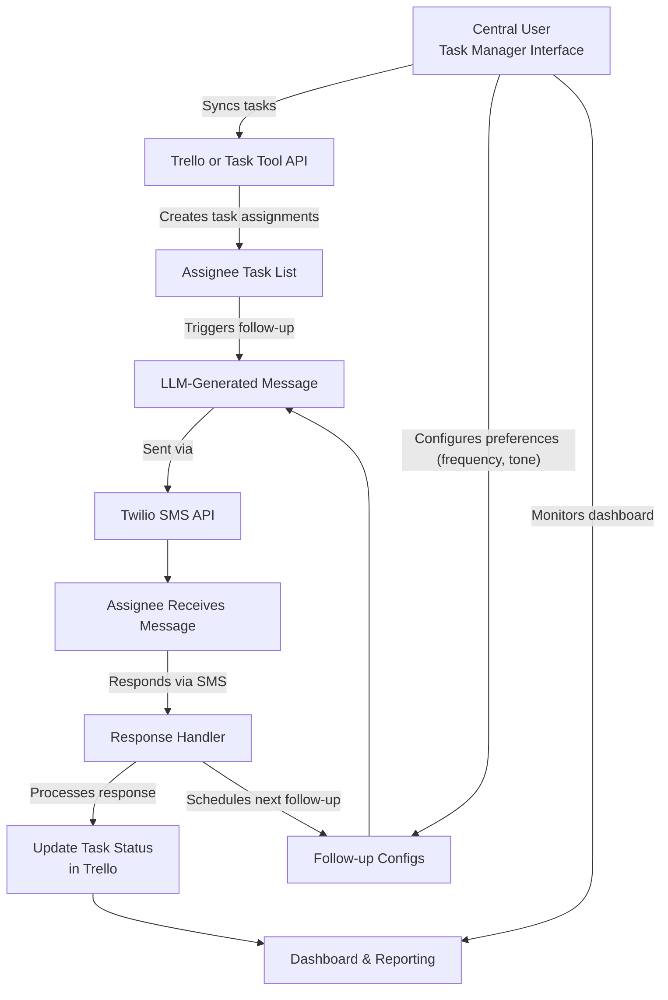

```mermaid
flowchart TD
    A[Central User<br>Task Manager Interface] -->|Syncs tasks| B[Trello or Task Tool API]
    A -->|"Configures preferences (frequency, tone)"| C[Follow-up Configs]
    A -->|Monitors dashboard| J[Dashboard & Reporting]

    B -->|Creates task assignments| D[Assignee Task List]
    D -->|Triggers follow-up| E[LLM-Generated Message]

    E -->|Sent via| F[Twilio SMS API]
    F --> G[Assignee Receives Message]

    G -->|Responds via SMS| H[Response Handler]
    H -->|Processes response| I[Update Task Status<br>in Trello]
    H -->|Schedules next follow-up| C

    I --> J
    C --> E
```